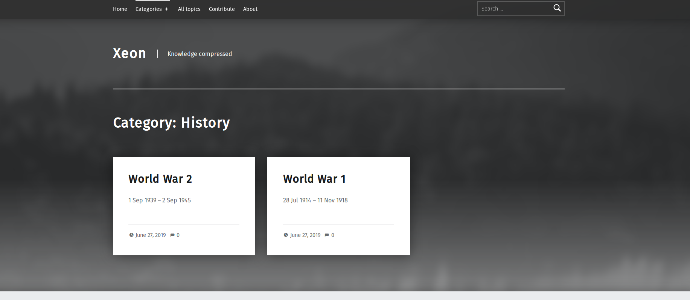

# Wordpress Blog using Messaging as a Service - Telegram Bot

## Introduction 
This project show case the usage of messaging as a service. We aim to provide a new way of handling a blogging portal. We use telegram bot API to create a bot that can manage a website only using messaging interface.
 
## Project objective 
* Build a simple blog website
* Build a bot to manage the website
* Enable anyone to contribute to the website
* Enable admin to manage website content using the same messaging service
 
## Target Audience  
* Bloggers
* Website Managers

## Features
* Management of blogs using telegram app.
* Categorization of post topic wise and author wise
* Public Access to add / modify post on the website
* Admin control to approve to changes requested by contributers
* Server runs constantly, auto starts if some error occurs.
* Extra Service : **TV and Movie Recommendation System**

## Architecture Model

---

## **Dependencies**
### Wordpress
### Telegram Bot
1. Open Telegram
1. Search for BotFather
1. Create a new Bot
1. Note the **API Token** of the bot.

### MySQL Database
### Python Pip
```
sudo apt install python3-pip
sudo pip3 install --upgrade pip
```
### Python Libraries
```
sudo pip3 install telebot bs4 mysql.connector pyTelegramBotAPI
```
---
## **Run Code**
* Clone repository 
```
git clone https://github.com/ft-abhishekgupta/telebot-wordpress-bloggingviamessaging-xeon
```
* Create a new database in MySQL : **wp_xeon**
* Import ```wp_xeon.sql``` into the database
* Copy Mordern to Wordpress Theme Folder ```var/www/html/wp-content/themes/```
* Change Wordpress Database to **wp_xeon**
    * Edit *wpconfig.php* in ```var/www/html/``` folder.
* Open Browser : localhost/wp-admin
    * Username : **root** Password : **password**
* Customize the site. (As per your own desire)
* Paste database configuration and API Token in ```telegram.py``` file and save.
* Open Terminal in the Repository Directory
```
python3 forever.py telegram.py
```
* Open Telegram and search for your Bot, and send **/start**.
* Admin Secret Password : **password** (Can be changed in the Code)
---
## Screenshots





---